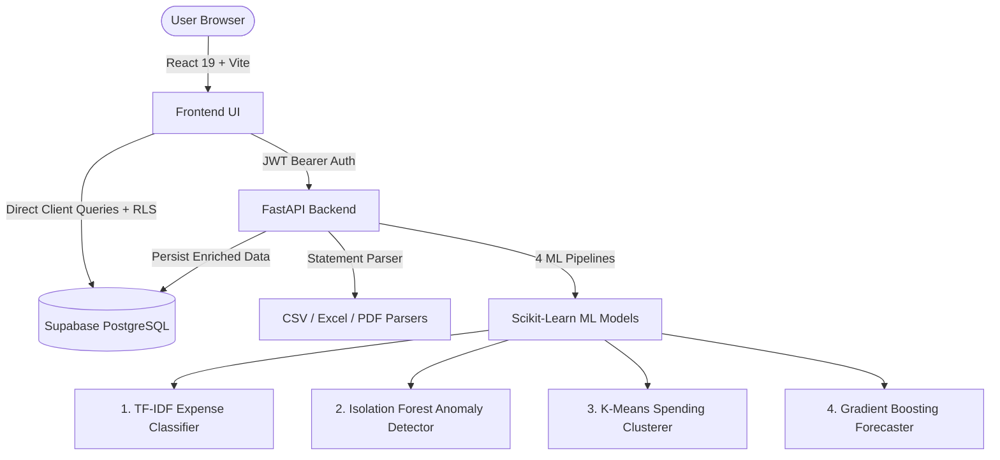

# 💳 Expense Buddy — AI-Powered Personal Finance & Expense Analytics

[](https://fastapi.tiangolo.com)
[](https://react.dev)
[](https://vitejs.dev)
[](https://supabase.com)
[](https://scikit-learn.org)
[](https://opensource.org/licenses/MIT)

**Expense Buddy** is a modern, full-stack personal finance application that brings intelligent, data-driven automation to your transactions. It features bank statement parsing (CSV, Excel, PDF), automatic column mapping, deduplication, and a suite of **4 trained Machine Learning models** for categorization, anomaly detection, spending behavior clustering, and predictive cash flow forecasting.

---

## 🌟 Key Highlights & Features

### 📄 1. Universal Statement Import Engine
- **Multi-Format Support:** Upload raw bank statements in **CSV**, **Excel (.xlsx / .xls)**, and **PDF** formats.
- **Auto Column Mapping & Preview:** Intelligent fuzzy matching identifies Date, Amount, Description, Debit/Credit columns automatically.
- **Smart Deduplication:** Prevents duplicate transaction records using deterministic hash fingerprints.
- **Batch Processing & Error Resilience:** Automatically normalizes dates, currencies, and descriptions.

### 🧠 2. 4-in-1 Machine Learning Engine
1. **Expense Classification (NLP + Linear Classifier):**
   - Automatically predicts categories (e.g., *Food & Dining, Bills & Utilities, Shopping, Entertainment, Healthcare, Travel, Salary*) from transaction descriptions with high confidence.
2. **Anomaly & Fraud Detection (Isolation Forest):**
   - Identifies statistically unusual expenses, irregular amounts, or spike patterns and flags them with contextual anomaly reasoning.
3. **Spending Persona Clustering (K-Means):**
   - Profiles spending patterns into behavioral archetypes (*e.g., High-frequency Essentials, Balanced Planner, Tech/Leisure Spender*) to deliver personalized financial insights.
4. **Time-Series Expense Forecasting (Gradient Boosting Regressor):**
   - Generates 30-day forward-looking spending projections with historical comparison and budget health metrics.

### 📊 3. Premium Interactive UI & Analytics
- **Modern Dark-Themed Glassmorphism UI:** Built with custom vanilla CSS design tokens, smooth animations, and Lucide icons.
- **Visual Analytics:** Category breakdowns, monthly trends, cash flow charts, and anomaly inspection powered by **Recharts**.
- **Enterprise Security:** Secured via **Supabase Auth**, JWT tokens, and strict PostgreSQL **Row-Level Security (RLS)**.

---

## 🏗️ System Architecture



---

## 📁 Repository Structure

```
expense-buddy/
├── backend/                        # FastAPI REST API & ML Services
│   ├── main.py                     # App entry point & lifespan model loader
│   ├── requirements.txt            # Python dependencies
│   ├── .env.example                # Backend environment template
│   ├── models/                     # Serialized scikit-learn model artifacts
│   │   ├── anomaly_detection/      # Isolation Forest pipeline
│   │   ├── expense_classification/ # TF-IDF + Classifier
│   │   ├── expense_forecasting/    # Forecaster model
│   │   └── spending_clustering/    # K-Means clustering pipeline
│   ├── parsers/                    # CSV, Excel, and PDF parser logic
│   ├── routers/                    # FastAPI routes (/import, /ml, /predict)
│   ├── schemas/                    # Pydantic request/response schemas
│   └── services/                   # ML inference, Supabase client, normalizers
├── frontend/                       # React 19 + Vite Dashboard
│   ├── src/
│   │   ├── components/             # Reusable UI components (Cards, Charts, Modal)
│   │   ├── contexts/               # React Auth Context (Supabase session)
│   │   ├── lib/                    # Supabase client setup
│   │   ├── pages/                  # Dashboard, Add Expense, Import, Analysis, Forecast
│   │   ├── services/               # Axios API clients & Supabase data services
│   │   ├── App.jsx                 # Routing & Layout
│   │   └── index.css               # Design system & CSS tokens
│   ├── package.json                # Frontend dependencies
│   └── .env.example                # Frontend environment template
├── model-training/                 # Jupyter notebooks & training pipelines
├── supabase_schema.sql             # Full database schema with RLS policies
├── .gitignore                      # Git ignore rules
└── README.md                       # Project documentation
```

---

## 🚀 Quick Start Guide

### Prerequisites
- **Node.js** (v18 or higher)
- **Python** (3.10 to 3.12 recommended)
- **Supabase Account** ([supabase.com](https://supabase.com))

---

### Step 1: Clone the Repository

```bash
git clone https://github.com/your-username/expense-buddy.git
cd expense-buddy
```

---

### Step 2: Supabase Database Setup

1. Create a new project on [Supabase](https://supabase.com).
2. Go to the **SQL Editor** in your Supabase Dashboard.
3. Open [`supabase_schema.sql`](./supabase_schema.sql) from this repository, paste its contents into the SQL Editor, and click **Run**.
4. Retrieve your **Project URL**, **Anon Key**, and **Service Role Key** from **Project Settings → API**.

---

### Step 3: Backend Setup

```bash
cd backend

# 1. Create and activate a virtual environment
python -m venv venv

# Windows:
.\venv\Scripts\activate
# macOS/Linux:
# source venv/bin/activate

# 2. Install dependencies
pip install -r requirements.txt

# 3. Configure environment variables
cp .env.example .env
```

Edit `backend/.env` with your Supabase credentials:
```env
SUPABASE_URL=https://your-project.supabase.co
SUPABASE_SERVICE_KEY=your_supabase_service_role_key
SUPABASE_ANON_KEY=your_supabase_anon_key
```

Run the backend server:
```bash
uvicorn main:app --reload --port 8000
```
> The API will be live at `http://127.0.0.1:8000` with interactive Swagger docs at `http://127.0.0.1:8000/docs`.

---

### Step 4: Frontend Setup

Open a new terminal window:

```bash
cd frontend

# 1. Install dependencies
npm install

# 2. Configure environment variables
cp .env.example .env
```

Edit `frontend/.env` with your credentials:
```env
VITE_API_URL=http://127.0.0.1:8000
VITE_SUPABASE_URL=https://your-project.supabase.co
VITE_SUPABASE_PUBLISHABLE_KEY=your_supabase_anon_key
```

Run the frontend development server:
```bash
npm run dev
```
> The web application will be accessible at `http://localhost:5173`.

---

## 📡 API Reference Overview

| Method | Endpoint | Description |
|---|---|---|
| `GET` | `/health` | Healthcheck and status of loaded ML models |
| `POST` | `/import/parse` | Parse uploaded CSV, Excel, or PDF statement |
| `POST` | `/import/confirm` | Batch import, deduplicate, categorize & save to Supabase |
| `GET` | `/import/history` | Retrieve user's statement import history |
| `POST` | `/predict/expense` | Classify a transaction description into a category |
| `POST` | `/predict/anomaly` | Check a transaction for spending anomaly |
| `POST` | `/predict/cluster` | Get spending persona cluster prediction |
| `POST` | `/predict/forecast` | Generate spending projection for the upcoming cycle |
| `POST` | `/ml/sync-user-models` | Batch run ML inference over user's existing transactions |

---

## 🔒 Security & Data Privacy

- **Row Level Security (RLS):** All database tables are locked down with PostgreSQL RLS policies ensuring users can only read and write their own financial records.
- **JWT Bearer Authentication:** Backend endpoints verify the incoming user token directly with Supabase Auth before processing transactions or running ML models.
- **Safe Environment Variables:** Secrets and keys are excluded from version control via strict `.gitignore` configurations.

---

## 🤝 Contributing

Contributions, issues, and feature requests are welcome!
1. Fork the project.
2. Create your feature branch (`git checkout -b feature/AmazingFeature`).
3. Commit your changes (`git commit -m 'Add some AmazingFeature'`).
4. Push to the branch (`git push origin feature/AmazingFeature`).
5. Open a Pull Request.

---

## 📄 License

Distributed under the MIT License. See `LICENSE` for more information.
